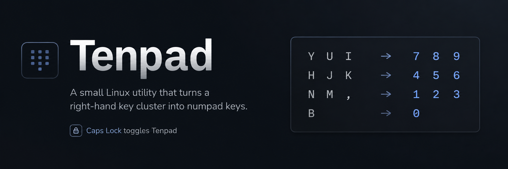

# Tenpad

Tenpad is a small Linux utility that turns a right-hand key cluster into numpad keys while it is toggled on.

Default layout:

```text
Y U I    ->  7 8 9
H J K    ->  4 5 6
N M ,    ->  1 2 3
B        ->  0
```

The default toggle key is `Caps Lock`. Hold `Caps Lock` and press `N` to send `Num Lock`.

## Requirements

- Linux with `/dev/input` and `/dev/uinput`
- Python 3.10+
- Permission to read keyboard input devices and write to `uinput`

## Install

On Arch Linux, install it like a local AUR-style package:

```bash
makepkg -si
```

After that, `tenpad` is available as a normal terminal command.

For development, use an editable virtual environment:

```bash
python -m venv .venv
. .venv/bin/activate
pip install -e .
```

## Run

```bash
tenpad
```

If your user does not have permission to access `/dev/input` and `/dev/uinput`, run `sudo tenpad` or configure input permissions for your user.

Tap `Caps Lock` to toggle Tenpad mode on or off. While Tenpad mode is on, the mapped letter keys are emitted as numpad keys and the original letters are suppressed.

Hold `Caps Lock` and press `N` to send `Num Lock`. If you configure a different toggle key, use that key with `N` instead.

Use a different toggle key with:

```bash
tenpad --toggle-key F12
```

Key names use Linux input names, so both `F12` and `KEY_F12` work.

## Notes

Tenpad grabs detected physical keyboards while running so it can suppress the original key presses. If anything behaves unexpectedly, press `Ctrl+C` in the terminal running Tenpad to release the keyboards.
